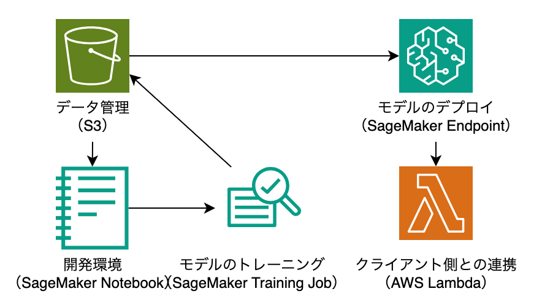
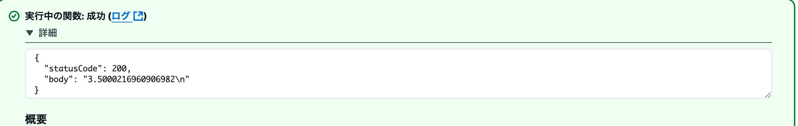

# MLワークフロー構築（SageMaker + S3 + Lambda）

<p align="center">
  
</p>


## 概要
このプロジェクトは、Amazon SageMaker と AWS の各種サービスを活用して、機械学習モデルの学習からデプロイ、推論までを一連のワークフローとして構築します。主に以下の構成要素で成り立っています。

## 全体の流れ
### 1. データ管理（S3）
学習用データやトレーニング後に出力されたモデルファイルは、すべて Amazon S3 バケットで管理されます。
ノートブックやトレーニングジョブ、推論結果とのデータの受け渡しにも S3 を活用します。

### 2. 開発環境（SageMaker Notebook）
SageMaker ノートブックインスタンスを利用して、トレーニングスクリプトの作成・実行を行います。
モデルの前処理や可視化、ジョブのトリガーもここから実行されます。

### 3. モデルのトレーニング（SageMaker Training Job）
ノートブックからトレーニングジョブを起動し、指定した S3 のデータを元にモデルの学習を行います。
学習完了後、成果物としてのモデルは S3 に保存されます。

### 4. モデルのデプロイ（SageMaker Endpoint）
保存されたモデルを SageMaker Endpoint にデプロイし、常時リクエストを受け付けられる API として提供します。
エンドポイントはHTTPSで外部からのアクセスが可能です。

### 5. クライアント側との連携（AWS Lambda）
AWS Lambda 関数を用意し、エンドポイントに HTTPS リクエストを送信するクライアントとして動作させます。
外部サービスやアプリケーションから Lambda を通じてリアルタイム推論が可能です。

## 起動デプロイ、テストの方法
このセクションでは、機械学習モデルの構築・デプロイ・推論テストまでの手順を説明します。
### 1. 準備
まず、以下のファイルを修正・コメントアウトします：

+ infra/modules/sagemaker/src/train_model.ipynb.py
→ <your_account_id> をご自身の AWS アカウントIDに置き換えてください。

Terraformのリソース一部をコメントアウト：
学習前には以下のファイルの定義を一時的にコメントアウトします（後で元に戻します）：

+ infra/modules/sagemaker/aws_sagemaker_model.tf
+ infra/modules/sagemaker/aws_sagemaker_endpoint.tf
+ infra/modules/sagemaker/aws_sagemaker_endpoint_configuration.tf

### 2. 基本インフラの構築
以下のコードを実行してインフラを構築します。
```
bin/terraform_apply
```
上記コマンドで、S3バケットやSageMaker Notebookインスタンスなどの基本的なインフラが構築されます。
### 3. モデルのトレーニング
1. AWS マネジメントコンソールにログインします。
2. 「Amazon SageMaker」>「ノートブックインスタンス」から該当のJupyter Notebookを開きます。
3. infra/modules/sagemaker/src/train_model.ipynb.py の中身をコピーして、新規ノートブックに貼り付け、セルを順に実行して学習を行います。

※ トレーニング完了後、モデルファイルはS3に自動保存されます。
### 4. モデルのデプロイ
上記で一時的にコメントアウトした3つの .tf ファイルのコメントアウトを解除します：

+ aws_sagemaker_model.tf
+ aws_sagemaker_endpoint_configuration.tf
+ aws_sagemaker_endpoint.tf

その後、再度Terraformを適用します：
```
bin/terraform_apply
```
これにより、学習済みモデルがエンドポイントとしてデプロイされます。

### 5. 推論テストの実行
1. Lambda関数のテストに使用するファイルを確認：

+ infra/modules/lambda/src/func1/in/test_code.json
```
{
    "features": [1.2, 0.7 ,8.9]
}
```

2. AWS マネジメントコンソールから該当の Lambda 関数を開き、「テスト」タブに上記JSONの内容を入力してテストを実行します。

3. 結果に応じて、エンドポイントからの推論応答が確認できます。

<p align="center">
  
</p>


### 停止
以下のコードを実行すると停止できます。
```
bin/terraform_destroy
```
